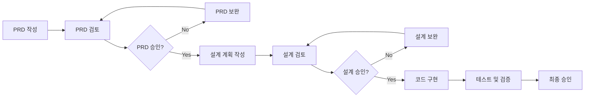

# 개발 워크플로우 가이드

## 🎯 목표
일관된 품질의 소프트웨어를 개발하기 위해 정립된 프로세스를 모든 개발 활동에 적용합니다.

## 📋 필수 개발 프로세스

### Phase 1: 요구사항 정의 (PRD)
1. **PRD 작성**
   - 제품 개요와 목표 명확히 정의
   - 기능/비기능 요구사항 상세 기술
   - 데이터 모델과 외부 인터페이스 명시
   - 검수 기준과 일정 계획 포함

2. **PRD 검토 및 보완**
   - 이해관계자와 요구사항 검토
   - 누락된 요구사항 보완
   - 모호한 부분 명확화
   - 최종 승인

### Phase 2: 설계 (Technical Design)
1. **기술 설계 계획 작성**
   - PRD를 기반으로 구현 방법 설계
   - 아키텍처와 기술 스택 결정
   - 주요 파일 구조와 클래스 설계
   - 핵심 구현 포인트 정의

2. **설계 검토 및 보완**
   - 기술적 타당성 검토
   - 성능/보안/확장성 고려사항 확인
   - 구현 순서와 우선순위 조정
   - 리스크 식별과 대책 수립

### Phase 3: 구현 (Implementation)
1. **사전 준비**
   - 구현 체크리스트 작성
   - 개발 환경 설정
   - 기본 코드 구조 생성

2. **코드 구현**
   - 설계 계획에 따른 코드 작성
   - 단위 테스트 동시 작성 (TDD 권장)
   - 코드 리뷰 진행
   - 지속적인 리팩토링

3. **검증**
   - 통합 테스트 수행
   - 성능 테스트
   - 요구사항 충족 여부 검증
   - 최종 검수 및 승인

## 🔄 반드시 거쳐야 할 단계



## ✅ 체크리스트

### PRD 단계
- [ ] 제품의 목적과 문제 정의가 명확한가?
- [ ] 모든 기능 요구사항이 상세히 기술되었는가?
- [ ] 비기능 요구사항(성능, 보안 등)이 명시되었는가?
- [ ] 데이터 모델이 설계되었는가?
- [ ] API/외부 인터페이스가 정의되었는가?
- [ ] 검수 기준이 명확한가?

### 설계 단계
- [ ] PRD의 모든 요구사항을 커버하는가?
- [ ] 아키텍처가 적절하게 설계되었는가?
- [ ] 핵심 클래스와 관계가 명확한가?
- [ ] 구현 순서가 논리적인가?
- [ ] 성능/보안 고려사항이 반영되었는가?
- [ ] 리스크와 대책이 수립되었는가?

### 구현 단계
- [ ] 설계 계획대로 구현되었는가?
- [ ] 단위 테스트가 충분히 작성되었는가? (커버리지 80% 이상)
- [ ] 코드 리뷰가 진행되었는가?
- [ ] 통합 테스트가 통과했는가?
- [ ] 모든 검수 기준을 충족하는가?

## 📝 문서 템플릿

### PRD 템플릿 구조
```markdown
# 제품 요구사항 문서 (PRD)
1. 제품 개요
   - 제품 정의
   - 문제 정의
   - 제품 목표

2. 기능 요구사항
   - 핵심 기능
   - 보조 기능
   - 유스케이스 정의

3. 비기능 요구사항
   - 성능 요구사항
   - 신뢰성 요구사항
   - 보안 요구사항
   - 운영 요구사항

4. 데이터 모델
   - 핵심 엔티티
   - 관계 정의
   - 상태 다이어그램

5. 외부 인터페이스
   - API 명세
   - 배치 스케줄

6. 검수 기준
```

### 설계 계획 템플릿 구조
```markdown
# 기술 설계 계획
1. 개요
   - 구현 목표
   - 제약사항

2. 아키텍처 설계
   - 패키지 구조
   - 계층별 설계
   - 주요 컴포넌트

3. 상세 설계
   - 클래스 다이어그램
   - 시퀀스 다이어그램
   - 데이터베이스 설계

4. 구현 전략
   - 구현 순서
   - 핵심 구현 포인트
   - 예외 처리 전략

5. 테스트 전략
   - 단위 테스트
   - 통합 테스트
   - 성능 테스트
```

## 🚀 실행 방법

1. **새로운 기능/개발 시작 시**
   - 항상 PRD 작성부터 시작
   - PRD 검토 후 승인 받기
   - 승인된 PRD로 설계 계획 작성
   - 설계 검토 후 승인 받기
   - 승인된 설계로 구현 시작

2. **프로세스 준수 확인**
   - 각 단계 완료 시 체크리스트 확인
   - 다음 단계로 넘어가기 전 반드시 승인 받기
   - 모든 문서는 버전 관리 (Git)

3. **도구 활용**
   - PRD/설계 문서는 Markdown으로 관리
   - 다이어그램은 Mermaid나 PlantUML 활용
   - 체크리스트는 GitHub Projects나 Jira 활용

## 💡 팁

- **완벽함보다 완성**: 처음부터 완벽한 문서보다 빠른 초안과 지속적인 개선
- **시각화**: 텍스트만으로 부족할 때 다이어그램 활용
- **피드백**: 각 단계에서 적극적인 피드백 요청
- **버전 관리**: 모든 문서의 변경 이력 추적

---

**이 워크플로우는 프로젝트의 성공을 위한 최소한의 약속입니다.**